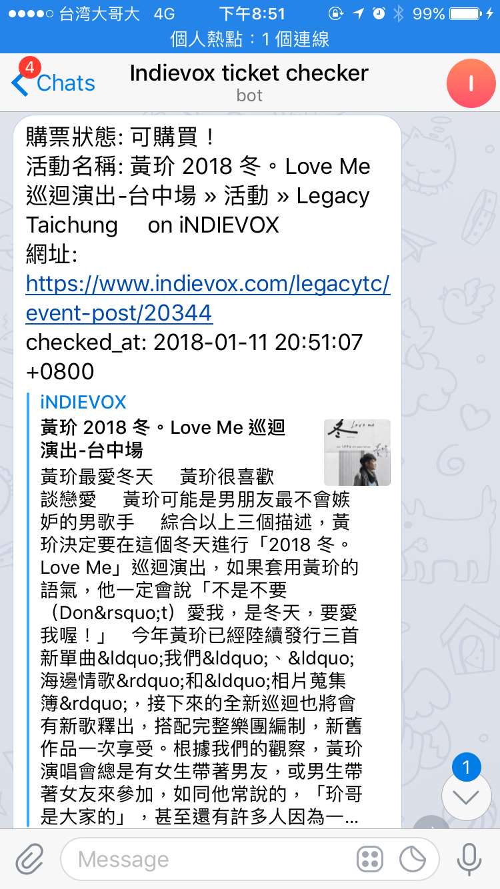

# INDIEVOX Ticket Checker

確認 INDIEVOX 票券狀態，可購買時傳送訊息通知使用者。

## DEMO


## 1. 新增 telegram bot

傳送訊息給 [BotFather](https://telegram.me/BotFather)。

* 輸入指令 `/newbot` 開始對話
* 輸入 bot 顯示名稱
* 輸入 bot username（必須以`bot`為結尾）

建立完成後會得到 API token
> Use this token to access the HTTP API: xxxxxxxxxxxxx

## 2. 設定通知對象、售票頁面網址

將參數範本檔 .env.example 重新命名為 .env，並填入參數數值。

* TELEGRAM_TOKEN: 第一步取得的 API token
* TELEGRAM_CHAT_ID: 通知對象的 CHAT_ID
  - 傳送訊息給 https://telegram.me/@get_id_bot，輸入 `/my_id`
* INDIEVOX_EVENT_URL: INDIEVOX 售票頁面

## 3. 執行

預設是 5 分鐘確認一次票券狀態，可參考 https://github.com/jmettraux/rufus-scheduler 調整頻率。

```ruby
ruby scheduler.rb
```
